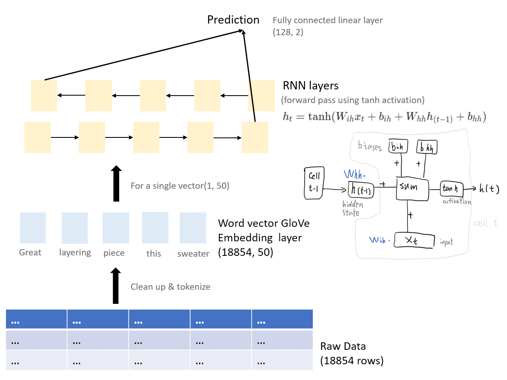
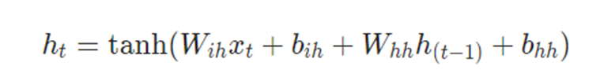
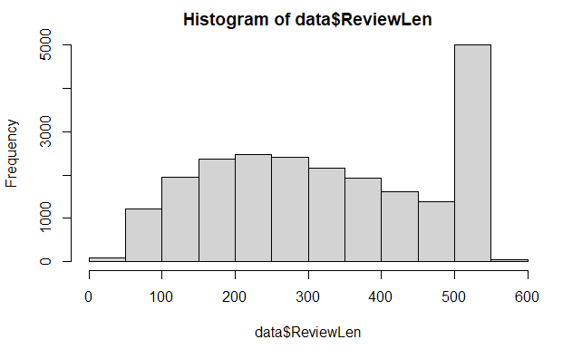
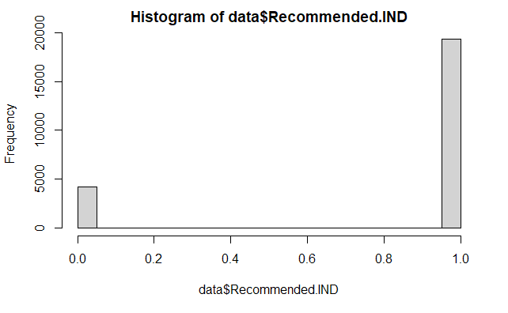
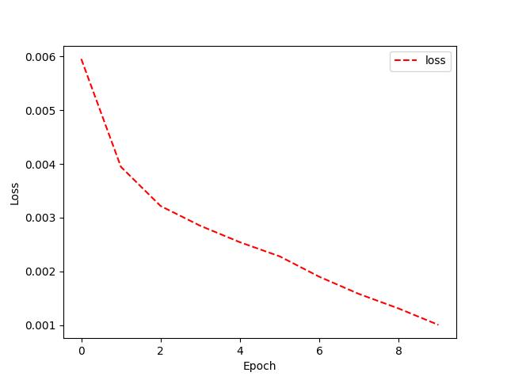
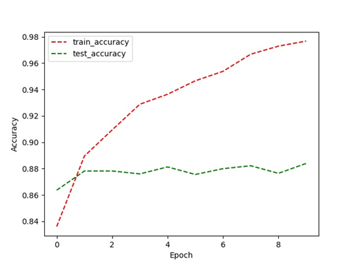
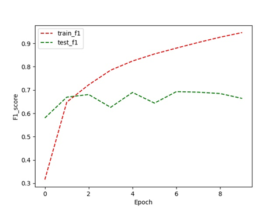
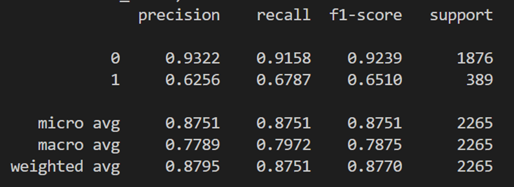

# CSC413 Final Project


> Xinlei Xu
>
> 1004711298

(for project structure, please see the `readme.md` within `code` folder)

## Introduction

In this project, we're building a RNN model to separate product reviews on women's clothing into 'recommend' and 'not recommend' categories. 

The raw data obtained from Kaggle is cleaned, augmented and tokenized, then converted into vector representation using GloVe pretrained vectors. 

We use a set of RNN layers to make predictions, and outputs a 2d vector representing the likelihood of recommendation. The model is compared to other machine learning algorithms on this dataset, and some limitations are found.

The architecture of the model is explained in the "model architecture" part:

<br>

## Model



In the Pytorch forward pass, the following steps are conducted:

- initialize hidden layers to 0 before calculation
- initialize the target vectors
- use `rnn_tanh` to calculate output


### **model architecture:**

The RNN model consists of a word vector **embedding layer**, **RNN layers**, and a **fully connected linear layer**. The output is a 2d vector representing recommend or not recommend.

The hidden state of a RNN layer is related to the current input and the hidden state of the previous layer, with the formula:




we learn the **parameters** `W_ih`, `b_ih`, `W_hh`, `b_hh` from the input data using the tanh function:

```python
cal = torch._C._VariableFunctions.rnn_tanh
result = cal(input, hx, 
             self._flat_weights, self.bias, self.num_layers,
             self.dropout, self.training, self.bidirectional, 
             self.batch_first)
```

The input layer is an embedding of size (18854, 50). The hidden layers have dimension of 64, and the output layer is a 2d vector. 

The **number of parameters** of the model is: `50*64 + 64^2 + 64*2 + 64*2 + 2 = 7554`

- `50*64` parameters from embed layer to the first hidden layer
- `64^2` parameters between the embed layers
- `64*2` parameters from embed layer to output layer
- `64*2+2` parameters from biases


### sample results:

The results are coming from the final model with Adam Optimizer, Cross Entropy loss, 10 epochs, lr=0.001, batch_size=64:

**successful example:** the label is `not recommend`, and the prediction is `not recommend`:

```
The is a cute dress with a great pattern and nice material. it would look great on the right kind of figure. i'm 5'7"" and slim, but at thirteen weeks pregnant and not showing, the skirt made me look about thirty weeks pregnant, but the top fit just fine."
```


**unsuccessful example:** the label is `recommend`, but the prediction is `not recommend`:

```
Very comfortable and flattering These pants are extremely comfortable and flattering. i bought them in coral, and wore with a black peasant top, sandals and a long necklace. they do stretch out a lot though, so i would recommend sizing down. i bought mine to look like they fit on the model, and after a few hours they were hanging off of me, so buy them a little bit tighter than you like. the drawstring is purely decorative and does not tighten the waist.
```


<br>

## Data

The dataset was collected from this [Kaggle](https://www.kaggle.com/datasets/nicapotato/womens-ecommerce-clothing-reviews) dataset on Women's E-commerce Clothing reviews on Amazon, and was scraped from open data in 2016. Actual clothing brands and the customer names are hidden for privacy considerations.


### summary statistics:

**review length:** the peak in 500-550 is due to special characters taking up the entire length of the review. The characters are cleaned before tokenizing.

```r
data <- read.csv("D:/CSC2/413/docs/reviews_eda.csv")
sd(data$ReviewLen)
mean(data$ReviewLen)
hist(data$ReviewLen)
---
[1] 147.2891
[1] 326.2828
```



**recommendation:** negative reviews (0) is fewer than positive reviews.

```r
sd(data$Recommended.IND)
mean(data$Recommended.IND)
hist(data$Recommended.IND)
---
[1] 0.3822156
[1] 0.8223623
```




### data transformations:

**clean up:** 

The original data set has the review split into two columns: the `title`, which is the review heading, and `Review Text`, which is the review body. I combined the two columns into a single column for a simpler model structure, and removed the rows with missing column data, such as empty review or empty ratings.

**data augmentation:** 

The review columns are translated to German (for having a different sentence structure & word order), and then translated back to English. The newly created entries are inserted into the training dataset. 4000 new rows are inserted into the total of 22641 rows. 

**dataset split:** 

After cleaning up the raw data, the remaining dataset was split into `train`, `valid` and `test` sets. The proportion used was 7:2:1, which is a commonly used proportion for splitting the dataset. The train dataset is then augmented to create more entries. The `valid` and `test` sets are not getting augmented, so they act as better representations for the real scenarios.

<br>

## Training

### training curve:

The model was trained for 10 epochs on the training dataset, and the accuracy vs. epoch graph can be seen below:

Increasing the epoch count could lead to overfitting, as the the accuracy on test dataset remained mostly the same after 5 epochs.




### hyperparameters:

Since the dataset is relatively small, I tuned the hyperparameters to reduce overfitting of the model:

```python
# hyperparameters
ebdsize =50
num_hiddens = 64
dropout=0.5				# 50% dropout
vocab_size = len(text.vocab)
output_dim =2 			# 'recommend' or 'not recommend'
label_num = 2
```

- **text length**: The parameter determines the length of the review that is being considered. The average length of review is 326 characters, so I tried setting it to 400 for large coverage, and gradually reduced it to 60, which has almost the same accuracy (~0.003 margin) and much faster compared to a higher length.
- **embed size:** The word vector has a size of 50, since we're using pretrained GloVe model that has a size of 50 dimensions.
- **hidden layer size:** The training task we're performing is a binary classification, so the hidden layer size was set to a smaller number of 64 to reduce overfitting of the model.
- **dropout rate:**  The dropout rate was set to a higher value to reduce overfitting. Some research I found online suggests that 0.5 (50%) dropout rate would be a good value for the hidden layers, and some testing on the validation set suggests similar results as well.
- **output dimension:** The goal of this project was to check whether the customer recommends the product or not, which is two dimensional.


<br>

## Results


### quantitative measures & results:

Both **test accuracy** and **F1 score** are used to evaluate the model. We also use **recall** to make help making justifications for the performance of the model. Accuracy is used to evaluate the model's ability to *correctly* make predictions, and F1 score is used to see how the model performs in terms of *incorrectly* classified results.


**quantitative results:**

The test accuracy had some slow increase as more epoch are performed, and fluctuates at around 88% in the end. The graph for F1 score had a similar tendency:





The summary of the model using `eval` function:




### qualitative results:

A summary of the model can be generated with the `eval` function.

When we print the attributes for `recommend` (1) and `not recommend` (0) as above, we can see that the the predicting accuracy for `recommend` is lower than that of `not recommend`. The model tends to make "not recommending" predictions, probably due to the uneven distribution of the labels from the dataset itself. 

When predicting long sequences with both good and bad aspects of the product, the model has a tendency to mark them as not recommend.


### justification:

The model performed reasonably well on this dataset. Since the dataset used was available on Kaggle, we can compare our results with other peoples' model directly. Some other models' performance on this dataset are listed below:

(Note that the training sets are augmented differently. The other models are [borrowed from Kaggle](https://www.kaggle.com/code/azizozmen/nlp-comparative-rnn-dl-models-with-detailed-eda), and evaluated locally on a same testing set generated for the project.)

| model (overall accuracy) | label | precision  | recall | f1-score |
| ------------------------ | ----- | ---------- | ------ | -------- |
| SVM (87%)                | 0     | 0.96       | 0.81   | 0.89     |
|                          | 1     | 0.56       | 0.87   | 0.67     |
| Random Forest (85%)      | 0     | 0.95       | 0.88   | 0.90     |
|                          | 1     | 0.57       | 0.79   | 0.68     |
| **This Project** (88%)   | 0     | **0.9322** | 0.9158 | 0.9239   |
|                          | 1     | **0.6256** | 0.6787 | 0.6510   |

The model has the highest recall rate among all 3 models since it's using RNN, and is more balanced on precision between recommend and not recommend. The model is on par with some of the highest rated notebooks for this dataset on Kaggle, so we can say that it's having a reasonable performance.

The limitations of the model are listed under 'Ethical Considerations' part.

<br>

## Ethical Considerations

The dataset collected was based entirely on women's clothing brands and reviews. Therefore, it would not be as accurate when being used on reviews of other clothing categories, such as men's clothing. 

**fairness & accuracy:**  

If the algorithm was used to recommend clothing products automated system, it would be less fair to the shops that supplies men's clothing, as the prediction on their reviews would be less accurate compared to women's clothing reviews. 

**transparency**: 

The nature of the machine learning model is that the derived parameters are hard to interpret. The predictions could be strongly correlated to some specific words, and in that case the influencers could potentially manipulate the reviews to make them look more appealing to the algorithm. The algorithm could be driven away from its original intentions, and recommending products based on its own rules instead of representing the reviewers.

**limitations:** 

The model used smaller word vectors & smaller hidden layer size to reduce overfitting. Using a larger vector size & larger hidden layers could achieve better results on the dataset, but has the risk of overfitting the dataset. Further tuning of the model might achieve slightly better results.

<br>

# Authors

The work was done by myself (Xinlei Xu).


<br>

# Acknowledgements

some references used in this project includes:

- [[1911.03329\] Memory-Augmented Recurrent Neural Networks Can Learn Generalized Dyck Languages (arxiv.org)](https://arxiv.org/abs/1911.03329)

- [torch.nn — PyTorch 1.11.0 documentation](https://pytorch.org/docs/stable/nn.html?highlight=torch)

- [Women's E-Commerce Clothing Reviews | Kaggle](https://www.kaggle.com/datasets/nicapotato/womens-ecommerce-clothing-reviews)

- [NLP: Comparative RNN & DL Models With Detailed EDA | Kaggle](https://www.kaggle.com/code/azizozmen/nlp-comparative-rnn-dl-models-with-detailed-eda)

- [What is the F1-score? (educative.io)](https://www.educative.io/edpresso/what-is-the-f1-score)

- [A Gentle Introduction to Dropout for Regularizing Deep Neural Networks (machinelearningmastery.com)](https://machinelearningmastery.com/dropout-for-regularizing-deep-neural-networks/)

- [Dropout: A Simple Way to Prevent Neural Networks from Overfitting (jmlr.org)](https://jmlr.org/papers/v15/srivastava14a.html)

- [Ethical principles in machine learning and artificial intelligence: cases from the field and possible ways forward (nature.com)](https://www.nature.com/articles/s41599-020-0501-9)

